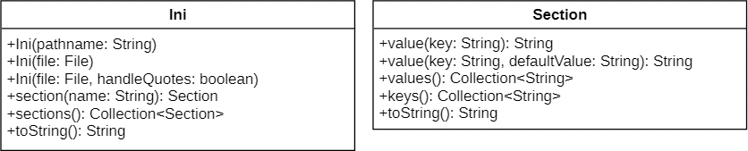

## Jini

**Jini** (short for _``Java ini``_) is a simple, flexible and lightweight configuration file parser (``.ini``) that's compatible with Java 7 and higher.



#### Examples

```java
public static void main(String[] args) throws IOException {

    Ini ini = new Ini(new File("test.ini"), true);
    
    // This can be used to verify parsed data, but also to get a
    // formatted version of the original .ini file, as you can see down below.
    System.out.println(ini);

    for(Section section : ini.sections()) {

        System.out.println("Section name: " + section);

        for(String key : section.keys()) {

            System.out.println(key + " = " + section.value(key));
        }
    }

    Section section1 = ini.section("section1");
    String value1 = section1.value("key1");
    
    // You can also define a default value in case the specified key does not exist
    String value2 = section1.value("key2", "Default value");

    // If there are no sections in a configuration file, you can still retrieve the keys
    Collection<String> ungroupedKeys = ini.section("").keys();

}
```

##### Formatting

Input:
```ini
[section1]
key1    = value1
key2    = value2

; This is a comment

[section2] ; This is another comment
key1=value1
key2=value2

[section3]
key1    = "value1"
key2="value2"
key3=   'value3'
```

Formatted output using ``ini.toString()`` and when ``handleQuotes`` is true:
```ini
[section1]
key1=value1
key2=value2

[section2]
key1=value1
key2=value2

[section3]
key1=value1
key2=value2
key3=value3
```